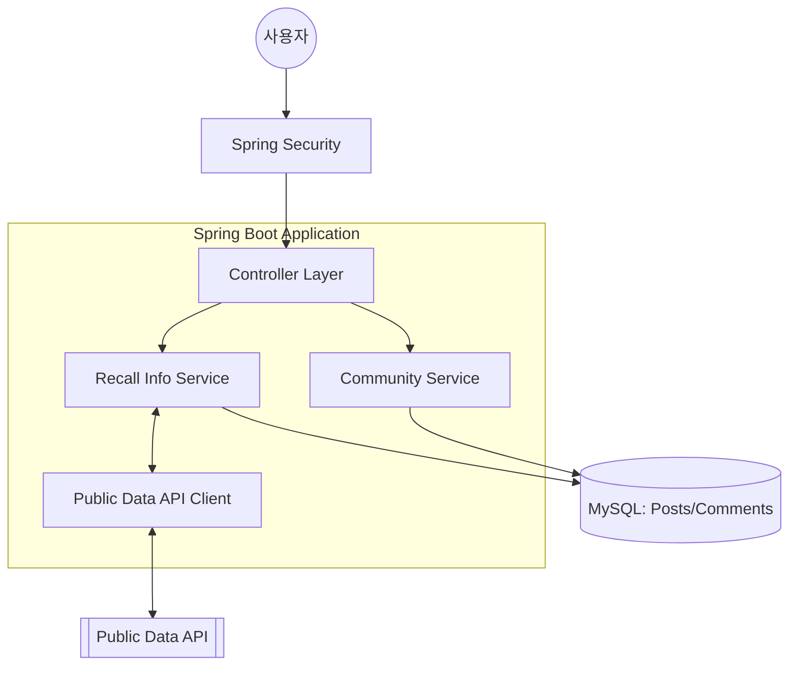
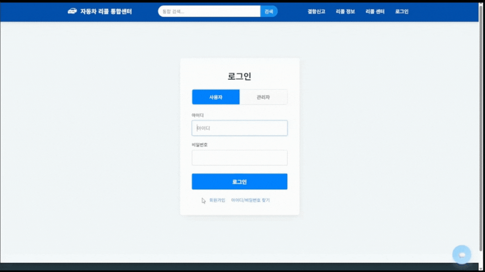
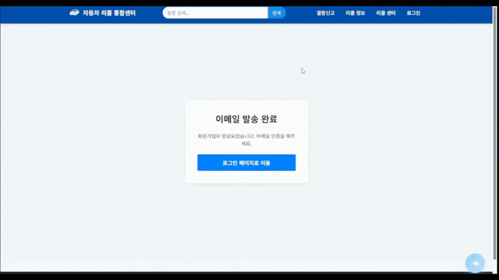
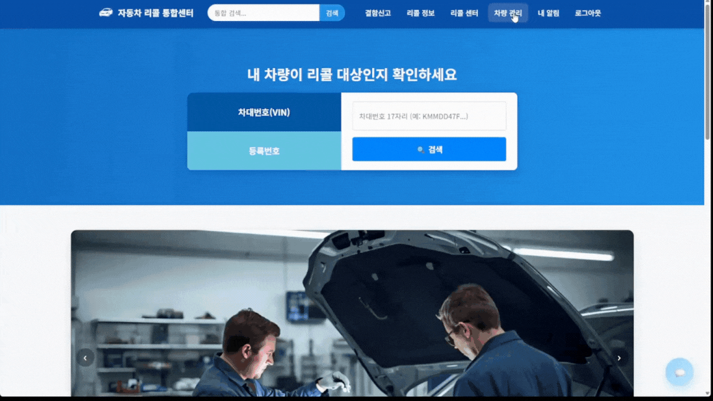
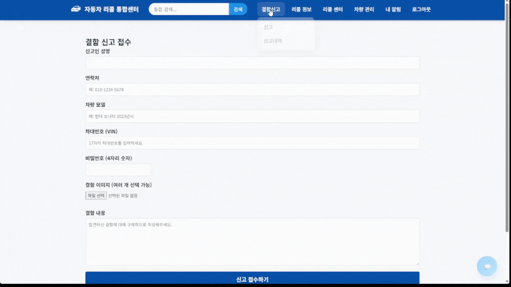

# 🚗 Car Recall Information System
> **공공데이터 API 기반 자동차 리콜 정보 조회 및 커뮤니티 플랫폼**

이 프로젝트는 국토교통부(또는 관련 공공기관)의 리콜 정보를 수집하여 사용자에게 제공하고, 자동차 소유주들이 리콜 관련 정보와 후기를 공유할 수 있는 커뮤니티 기능을 결합한 서비스입니다.

---

## 🎯 프로젝트 선정 배경


### 1. 📢정보의 파편화
* **비효율적 탐색:** 리콜 정보가 여러 기관 및 제조사 웹사이트에 흩어져 있어 일일이 방문해야 하는 번거로움이 있음
* **접근성 저하:** 사용자에게 꼭 필요한 안전 정보가 통합되어 있지 않아 신속한 확인이 어려움
* **정보 격차 발생:** 업데이트되는 최신 리콜 소식을 실시간으로 파악하기 힘든 구조적 한계가 존재함

<br/>

### 2. 🛠️신고 및 소통의 불편함
* **복잡한 절차:** 결함 신고나 문의 과정이 까다로워 사용자가 중도에 포기하게 됨
* **정보 부족:** 신고 시 필요한 정보나 작성 가이드가 부족하여 정확한 사례 접수가 어려움
* **채널 부재:** 제조사나 관련 기관과의 직접적인 소통 창구가 마련되어 있지 않아 사용자 피드백이 단절됨
<br/>

### 3. 📊 관리 및 분석의 비효율성
* **수동적 관리:** 데이터 수집과 관리가 자동화되지 않아 인적/시간적 리소스 낭비가 심함
* **현황 파악의 한계:** 산재된 데이터를 시각화하거나 통계적으로 분석할 수 있는 도구가 부족함
* **대응 속도 저하:** 체계적인 관리 시스템의 부재로 인해 리콜 사후 조치나 모니터링이 지연됨
<br/>


## 🛠 Tech Stack (기술 스택)

| 분류 | 기술 |
| :--- | :--- |
| **Backend**        |      |
| **Database**       |                                                                                                                                                                                                                                                                                                                                                                                         |
| **Frontend**       |                                                                                                                                                                                                               |
| **AI / Data**      |                                                                                                                       |
| **API / External** |                                                                                                                                                                                                                                                                                                                                                                              |
| **Collaboration**  |                                                                                                                                         |


---

## 📁 Project Structure (프로젝트 폴더 구조)

```
BOOT_CAR_RECALL/
├── python_ai/                   
├── src/
│   └── main/
│       ├── java/com/boot/       
│       │   ├── config/          
│       │   ├── controller/      
│       │   ├── dao/             
│       │   ├── domain/         
│       │   ├── handler/         
│       │   ├── OpenAiClient/    
│       │   ├── service/         
│       │   ├── util/           
│       │   └── BootCarRecallApplication.java  
│       └── resources/           
│           ├── mybatis/mappers/
│           ├── static/          
│           │   ├── css/
│           │   ├── img/
│           │   ├── js/
│           │   ├── python/
│           │   └── video/
│           ├── templates/      
│           ├── application.properties 
│           └── mybatis-config.xml    
├── build.gradle                 
├── gradlew / gradlew.bat       
├── recall_Pasing.py             
├── README.md                    
└── tablesetting.txt             
```

<br/>

---

## ✨ Key Features

**🔍 리콜 정보 조회 (Recall Info)**

공공 API 연동: 실시간으로 최신 자동차 리콜 데이터를 호출하여 사용자에게 제공합니다.

검색 및 필터링: 제조사, 모델명, 생산 기간별로 세분화된 리콜 정보 검색 기능을 지원합니다.

데이터 캐싱: 빈번한 API 호출을 방지하기 위해 조회된 데이터를 로컬 DB에 캐싱하여 성능을 최적화했습니다.

**💬 차량 결함 등록**

차량 결함 사례 등록:  실제 차량 결함을 등록하는 기능을 제공합니다.

이미지 업로드: 차량 결함을 확인할 수 있는 사진 등을 업로드 할 수 있는 기능입니다.

**👑 관리자 기능 (Admin Back-office)**

리콜 데이터 수동 업데이트: API 장애 시를 대비한 수동 데이터 등록 및 관리 기능.

대시보드: 리콜 통계 및 사용자 활동 지표 모니터링.


## 🏗 System Architecture


**[ERD]**


<br/> 

**[업무 흐름도]**


[메인페이지]


<br/>

## 📂 Project Documents (기타 문서)
| 문서 종류 | 파일명 | 형식 | 바로가기 |
| :--- | :--- | :---: | :---: |
| **메뉴 구조도** | 메뉴구조도.pdf |  | [📄 문서 보기](./img/메뉴구조도_1팀.docx) |
| **테이블 명세서** | 테이블명세서.xls |  | [📊 시트 보기](./img/pilot_project2_테이블_명세서_제출용.xls) |
| **화면 설계서** | 화면설계서.pdf |  | [📄 문서 보기](./img/디자인인(2).pdf) |

---

## 🚀 결과

<details>
  <summary><b>메인페이지</b></summary>

  

  화면 설명
  - 메인페이지에서 차대번호, 차량 등록번호로 리콜 대상 여부 조회가 가능합니다.
  - 메인 배너로 각종 안내를 제공합니다.
</details>

---

<details>
  <summary><b>회원가입</b></summary>

  

   화면 설명
  - 회원가입 시 3가지 정보를 적습니다.
</details>

---

<details>
  <summary><b>로그인</b></summary>

  

   화면 설명
  - 회원가입 시 작성했던 이메일을 통해 인증을 받습니다.
  - 인증 버튼을 누르면 로그인 페이지로 이동 후 로그인 시 세션을 가지고 메인페이지로 이동합니다.
</details>

---

<details>
  <summary><b>차량관리&내알림</b></summary>

  

   화면 설명
  - 내 차량을 클릭 해 본인의 차량을 등록, 삭제 할 수 있습니다.
  - 차량 등록 시 리콜 정보 속에서 관련된 정보만 필터링이 가능합니다.
  - 내 알림 기능으로 사이트 내 각종 알람등을 받을 수 있습니다.
  - 읽지 않은 알람과 읽은 알람은 색상과 NEW뱃지 유무로 구분을 줘 알 수 있습니다.
  - 해당 기능은 회원가입 통해 로그인 시 이용할 수 있는 기능입니다.
  
</details>

---

<details>
  <summary><b>결함신고&신고내역</b></summary>

  

   화면 설명
  - 결함신고 시 7개의 정보를 입력합니다.
  - 신고 시 적었던 비밀번호로 결함신고 내역을 수정, 삭제를 할 수 있습니다.
  - 신고 내역에서 검색을 할 수 있으며 CSV, PDF파일등으로 내역을 다운받을 수 있습니다.
  - 신고 내역 상세보기를 통해 리콜 가능성과 유사 사례, 예상 고장 부위를 로지스틱 회귀 분석을 통해 예측 할 수 있습니다.
  
</details>

---

<details>
  <summary><b>리콜현황</b></summary>

  

   화면 설명
  - 제조사/ 차종으로 리콜 사례들을 검색할 수 있습니다.
  - 상세보기를 통해 자세한 정보를 볼 수 있습니다.
  - 해당 내용 또한 CSV,PDF 파일로 받을 수 있습니다.
  
</details>

---

<details>
  <summary><b>서비스 센터 찾기</b></summary>

  

   화면 설명
  - 사용자의 위치 기반으로 서비스 센터를 찾을 수 있습니다.
  - 정비소 이름 또는 차종을 통해서 서비스 센터를 찾을 수 있습니다.
  - 반경을 선택해 거리 제한을 둘 수 있습니다.
  - 서비스 센터 리스트와 지도를 연동시켜 리스트에 표시된 센터는 지도에 반영되며 지도 이동시 자동으로 리스트를 새로고침합니다.
  
</details>

---

<details>
  <summary><b>챗봇</b></summary>

  
  

   화면 설명
  - 사용자가 챗봇을 클릭 시 시나리오기반의 챗봇이 사용자를 응대합니다.
  - 상담가 연결을 누를 시 관리자 챗봇으로 요청이 가고 관리자가 수락 시 상담사와 연결합니다.
  - 다수의 사용자와 채팅이 가능하며 채팅 목록을 통해 동시에 많은 고객을 응대 할 수 있습니다.
  - 종료 시 알람이 가고 사용자는 다시 시나리오 기반 챗봇으로 돌아갑니다.
  - 언제든지 다시 요청을 할 수 있습니다.
  
  
</details>

---
## 👥 Team Members (팀원 및 역할)
| 이름           | 포지션       | 담당 역할                                                                                                                                                     |
| :----------- | :-------- | :-------------------------------------------------------------------------------------------------------------------------------------------------------- |
| **조상진** (팀장) | FullStack | • JSP → Thymeleaf 변경<br>• Oracle → MySQL 변경<br>• 관리자 페이지 담당<br>• 관리자 공지사항, FAQ, 마이페이지 기능 구현<br>• 전반적인 문서 작업                               |
| **주석우**      | FullStack |  • 로그인, 화원가입 및 이메일 인증 구현<br>• 챗봇 사이트 최적화<br>• 상담원 채팅방<br>• 문의페이지 담당<br>• 고객센터 백·프론트 기능 구현<br>• 메인페이지 프론트 설계                                                                           |
| **김가영**      | FullStack | • 카카오맵 API 기반 기능 구현<br>• 리콜 센터 찾기 전체 UI/로직<br>• 리콜 통계 기능 개발<br>• 전반적인 프론트 담당<br>• 리콜센터 소개 코드 작성<br>• 메인페이지 프론트 설계 및 구현<br>• PPT 제작                        |
| **한경훈**      | FullStack | • 메인 페이지 담당<br>• 결함 신고, 리콜현황 기능 구현<br>• 검색 기능 활성화<br>• 알림 발송 기능<br>• 스프링 시큐리티 로그인<br>• 차대번호 / 차량등록번호 조회<br>• 비로그인 기능<br>• 내차량 관리 기능                       |
| **최민규**      | FullStack | • 리콜보도자료 페이지 담당<br>• 차량 리콜 정보 CSV 파싱<br>• 보도자료 게시판 기능 구현<br>• DB 구상<br>• 결함 신고, 유사 사례 기능 추가<br>• 로지스틱 리콜 확률, 유사 사례<br>• LSTM 고장 부위 예측<br>• TF-IDF 유사사례 보기 |
| **최예성**      | FullStack | • 공지사항, FAQ 기능 구현<br>• CSV, PDF 파일 다운로드<br>• 문서 작업                                                                   |
